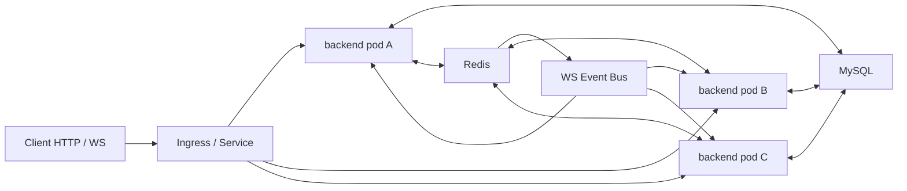

# Backend Multi-Pod Redis Event Bus Design

## Context

The production k3s backend currently runs as a single `live-auction-backend` Deployment replica. The Kubernetes Service and Ingress can route traffic to multiple backend pods, but the application is not yet fully multi-pod safe.

The important existing properties are:

- HTTP APIs are mostly stateless and use MySQL, Redis, or signed tokens as shared state.
- WebSocket tickets are stored in Redis, so a ticket can be issued by one pod and consumed by another pod.
- Each backend pod keeps its own in-memory WebSocket connection registry.
- Current `wsevent.Broadcaster` fanout and unicast only deliver to the local pod's in-memory connections.
- Auction write state is centralized in Redis Lua, with MySQL as durable persistence.
- Each backend pod starts the same cron jobs during module load.

Because of this, simply changing `replicas: 1` to `replicas: 2` or `3` would split WebSocket connections across pods while broadcasts would only reach the pod that produced the event. Cron jobs would also run once per pod.

## Goals

1. Allow `live-auction-backend` to run 2 or 3 replicas safely.
2. Let HTTP requests and WebSocket connections land on any backend pod.
3. Deliver room fanout and user unicast events to WebSocket clients connected to any backend pod.
4. Recover correct auction state after WebSocket reconnect with an authoritative snapshot.
5. Prevent multi-pod cron duplication from amplifying database scans or broadcast traffic.
6. Prevent multi-pod ranking cache rebuilds from stampeding MySQL.
7. Add Kubernetes probes and rollout settings for safe multi-replica operation.
8. Keep the first implementation compatible with the current module layout.

## Non-Goals

- Do not split the backend into separate API, WebSocket gateway, and auction worker Deployments in the first version.
- Do not introduce Redis Cluster in the first version.
- Do not implement full missed-event replay in the first version.
- Do not solve node-level high availability for the current single-node k3s cluster.
- Do not replace Redis Lua as the real-time auction serialization point.

## Recommended Approach

Use the current backend as a multi-replica monolith:

- MySQL remains durable persistence.
- Redis remains the real-time auction state layer.
- Redis also becomes the cross-pod WebSocket event bus.
- Each pod keeps local WebSocket connections and only performs local delivery after receiving bus events.
- Cron execution is protected by Redis leases.
- Ranking cache rebuilds keep the current in-process `singleflight`, but add a Redis lease so only one pod rebuilds a missing ranking for an item at a time.

This is the smallest architecture that preserves current code boundaries while making multiple backend replicas semantically correct.



## Event Bus

### Interface Shape

Keep the existing `pkg/wsevent.Broadcaster` interface:

```go
type Broadcaster interface {
    Fanout(topic string, event Event) error
    Unicast(addr string, event Event) error
}
```

Replace the direct hub broadcaster with a distributed broadcaster that:

1. Publishes an event envelope to Redis.
2. Subscribes to Redis events in every backend pod.
3. Delivers received envelopes to the local hub only.

The local hub should expose local-only methods or an internal adapter so subscribed events do not get republished and loop forever.

### Envelope

All cross-pod WebSocket events should be wrapped in a stable envelope:

```json
{
  "event_id": "evt_...",
  "scope": "room",
  "target": "room_123",
  "type": "bid_success",
  "payload": {},
  "auction_version": 12,
  "source_pod": "backend-abc123",
  "created_at_unix_ms": 1710000000000
}
```

Fields:

| Field | Purpose |
| --- | --- |
| `event_id` | Unique event identity for logging and optional client dedupe. |
| `scope` | `room` or `user`. |
| `target` | Room ID or user ID without the `room:` / `user:` prefix. |
| `type` | Existing event type such as `bid_success`, `auction_ended`, or `time_sync`. |
| `payload` | Existing event payload. |
| `auction_version` | Monotonic item-level version when available. |
| `source_pod` | Pod that produced the event, useful for tracing. |
| `created_at_unix_ms` | Server timestamp for diagnostics and client ordering. |

### Pub/Sub First Version

Use Redis Pub/Sub for the first implementation:

```text
ws:event:room
ws:event:user
```

Reasons:

- Low latency.
- Simple operational model.
- Fits the first-version reconnect strategy, where snapshot is authoritative and missed transient events are not replayed.

Failure behavior:

- If publish fails, the HTTP or service path should log and record a broadcast failure metric.
- Auction writes should not be rolled back only because a non-critical WebSocket broadcast failed.
- Clients recover through reconnect snapshot or read APIs.

### Future Stream Upgrade

Redis Stream can be added later when missed-event replay is required:

```text
ws:stream:room:{room_id}
```

Clients would reconnect with `last_event_id`, the server would replay recent stream entries, then send an authoritative snapshot. This is intentionally deferred because the current priority is correct auction state, not complete animation replay.

## WebSocket Reconnect

Reconnect must not depend on landing on the same pod.

Flow:

1. Client detects WebSocket close.
2. Client requests a fresh `/api/v1/ws-ticket`.
3. Client connects to `/ws/v1/rooms/{room_id}?ticket=...`.
4. The selected pod consumes the Redis ticket.
5. The pod registers the connection in its local hub.
6. The pod immediately sends `auction_snapshot` for the current room item when available.
7. Client treats the snapshot as authoritative and resumes processing incremental events.

Client-side ordering rules:

- Apply `auction_snapshot` as the source of truth.
- Apply incremental events only when their `auction_version` is newer than the local version.
- Drop duplicate or older events.
- Treat `time_sync` as clock and remaining-time correction only; it must not overwrite ended or winner state.

Important cases:

- If a bid HTTP request times out while WS disconnects, the client retries with the same idempotency key. Redis Lua returns the same accepted result rather than creating a duplicate bid.
- If the auction ends while disconnected, snapshot returns `ended`, winner, deal price, and ended timestamp.
- If `order_created` is missed, the winner can refresh through order APIs. Stream replay can improve this later.

## Cron Coordination

Every backend pod currently registers the same cron jobs. In multi-pod mode, each cron job should be wrapped with a Redis lease.

Lease algorithm:

```text
SET cron:lease:{name} {pod_id}:{token} NX EX {ttl_seconds}
```

Only the pod that acquires the lease executes the job. The TTL must exceed the normal job duration but remain short enough that another pod can continue after a crash.

Recommended first-version leases:

| Cron | Cadence | Lease TTL |
| --- | ---: | ---: |
| `item.settle_due_auctions` | 1s | 2s |
| `item.broadcast_time_sync` | 1s | 1s |
| `item.end_expired_auctions_fallback` | 1m | 30s |
| `order.scan_expired_orders` | 5m | 2m |
| `order.scan_compensation` | 10m | 2m |

Notes:

- `SettleAuctionLua` already prevents double settlement, but the lease avoids repeated scans and duplicate broadcasts.
- Order status updates should remain conditional and idempotent.
- If Redis is unavailable, high-risk auction cron jobs should skip execution rather than run independently on every pod.

## Ranking Rebuild Coalescing

The current ranking read path uses Go `singleflight.Group` to coalesce concurrent Redis ranking misses before rebuilding from MySQL bid logs. That only works inside one process. With multiple backend pods, the same hot item can miss Redis on every pod and each pod can run its own MySQL `ListBidRanking` rebuild.

Keep the in-process `singleflight`, but treat it as the inner guard only. Add a Redis-backed distributed rebuild lease around the MySQL rebuild:

```text
SET auction:item:{item_id}:ranking:rebuild_lock {pod_id}:{token} NX PX 1000
```

Recommended behavior:

1. `GetRanking` first reads Redis ranking as it does today.
2. If Redis returns entries, return them.
3. If Redis misses and `shouldRebuildRanking` says rebuild is useful, enter the existing local `singleflight`.
4. Inside the local `singleflight`, try to acquire the Redis rebuild lock for the item.
5. The lock owner rebuilds from MySQL, writes the ranking back to Redis, and returns the rebuilt entries.
6. A pod that does not get the lock waits briefly with jitter, re-reads Redis ranking, and returns the fresh Redis result if available.
7. If the lock holder crashes, the lock TTL expires and a later request can rebuild.
8. If MySQL returns no entries for an item whose Redis state has bids, set a short rebuild cooldown marker so empty or lagging bid-log windows do not cause every request to retry the rebuild immediately.

Suggested keys:

| Key | Purpose | TTL |
| --- | --- | ---: |
| `auction:item:{item_id}:ranking:rebuild_lock` | Distributed singleflight lock for MySQL ranking rebuild | 1s |
| `auction:item:{item_id}:ranking:rebuild_cooldown` | Short marker after empty/error rebuild windows | 1-2s |

This does not make ranking reads strictly serialized. It only prevents cache-miss rebuild storms across pods. Redis Lua remains the authority for accepted bids, while Redis ranking and MySQL bid logs remain read models.

Failure behavior:

- Redis ranking read fails: keep current safe fallback behavior.
- Rebuild lock acquisition fails because Redis is unavailable: do not add another MySQL stampede path; either use the existing MySQL fallback only when cache is nil, or return the best safe empty/current-user response.
- Lock not acquired: do not query MySQL from the losing pod; wait and re-read Redis.
- Rebuild succeeds but Redis write fails: return rebuilt entries to the current request, record/log the Redis write failure, and rely on TTL retry for later requests.

## Health Checks

Split health into three concepts.

### `/livez`

Liveness only means the process is alive and should not be restarted.

Rules:

- Do not ping Redis.
- Do not ping MySQL.
- Return `200` unless the process is internally unrecoverable.

### `/readyz`

Readiness means the pod can receive normal traffic.

First-version rule:

- MySQL unavailable: `503`.
- MySQL available and Redis degraded: `200`, with Redis degradation exposed through `/health`.

Reason: this backend is still a monolith. Redis degradation should not remove all account, browse, and order traffic if MySQL-backed paths are still usable.

### `/health`

Detailed component health for monitoring and diagnosis:

- MySQL status and latency.
- Redis status and latency.
- Event bus subscription status.
- Auction write availability.
- Cron lease availability.

`/health` may return `503` when degraded if alerting needs non-2xx status.

## Kubernetes Deployment

After application changes land, update `deploy/k8s/11-app.yaml`.

Recommended initial settings:

```yaml
spec:
  replicas: 2
  strategy:
    type: RollingUpdate
    rollingUpdate:
      maxUnavailable: 0
      maxSurge: 1
  template:
    spec:
      terminationGracePeriodSeconds: 30
      containers:
        - name: app
          ports:
            - containerPort: 8080
          startupProbe:
            httpGet:
              path: /livez
              port: 8080
          livenessProbe:
            httpGet:
              path: /livez
              port: 8080
          readinessProbe:
            httpGet:
              path: /readyz
              port: 8080
```

After validation, move from 2 replicas to 3.

Future multi-node settings:

- Pod anti-affinity so backend pods spread across nodes.
- PodDisruptionBudget with `minAvailable: 1` or `2`.
- External or HA Redis and MySQL, because multiple pods on a single-node k3s cluster do not provide node-level availability.

## Observability

Add metrics for:

- Event bus publishes by result and event type.
- Event bus deliveries by pod, scope, target, result, and event type.
- Event bus subscription reconnects and errors.
- Ranking rebuild lease acquisition, skip, cooldown, and rebuild result.
- Local WS recipients and dropped deliveries.
- Cron lease acquisition result.
- Cron skipped due to lease not acquired.
- Reconnect snapshot success or failure.

Logs should include:

- `event_id`
- `source_pod`
- `target`
- `event_type`
- `auction_version`
- `cron_name`
- `lease_owner`

Do not log credentials, tickets, Redis connection strings, or full authorization headers.

## Testing Strategy

Unit tests:

- Distributed broadcaster publishes the correct envelope for room fanout and user unicast.
- Subscriber dispatches bus envelopes to local hub without republishing.
- Source pod does not cause an infinite loop.
- Malformed envelopes are ignored and counted.
- Cron lease wrapper executes only when the lease is acquired.
- Cron lease wrapper skips when another owner holds the lease.
- Reconnect registration sends snapshot when a room current item exists.

Integration-style local tests with fakes:

- Two fake hubs connected through the same fake bus both receive a room fanout.
- User unicast only delivers to pods that have that user connected.
- Snapshot overrides stale client state after reconnect.

Agent online tests, following `docs/agent-testing/README.md`:

- Deploy 2 replicas.
- Verify both backend pods become Ready.
- Open WebSocket clients distributed across pods if observable.
- Place bids through HTTP and confirm all clients receive bid and ending events.
- Restart or roll one pod and confirm reconnect snapshot restores state.
- Confirm cron metrics show one active executor per lease window.
- Confirm no backend restarts, panics, or OOM events.

## Rollout Plan

1. Add local-only hub delivery methods and distributed broadcaster abstraction.
2. Implement Redis Pub/Sub publisher and subscriber.
3. Wire backend startup so the WS module creates the distributed broadcaster when Redis is available.
4. Add reconnect snapshot tests and client event-version contract documentation.
5. Add Redis-backed distributed coalescing for ranking rebuilds while keeping local `singleflight`.
6. Add Redis cron lease helper and wrap item and order cron jobs.
7. Add `/livez` and `/readyz`; keep `/health` for detailed diagnostics.
8. Update k3s Deployment probes and rollout strategy with `replicas: 2`.
9. Run unit tests.
10. Run agent-guided online validation with 2 replicas.
11. Increase to 3 replicas only after evidence shows stable fanout, reconnect, ranking rebuild coalescing, and cron lease behavior.

## Open Decisions

1. Pub/Sub channel layout can be either global by scope or sharded by room. First version should use global scope channels for simplicity.
2. Client protocol should expose `auction_version` consistently across all auction-related events before relying on strict client dedupe.
3. Redis HA is outside this implementation, but production readiness should treat it as the next infrastructure milestone.
4. Ranking rebuild lock TTL should start at 1 second and be tuned from observed MySQL rebuild latency.

## Acceptance Criteria

- Backend runs with 2 replicas and both pods are Ready.
- A room event produced by either pod reaches WebSocket clients connected to both pods.
- A user unicast event reaches the target user regardless of which pod holds the connection.
- Reconnecting to a different pod sends an authoritative `auction_snapshot`.
- Concurrent cron instances do not all execute the same leased job.
- Concurrent ranking Redis misses across multiple pods result in one MySQL rebuild per item per lock window.
- Rolling update keeps at least one backend pod Ready.
- Unit tests cover broadcaster, subscriber, ranking rebuild lease, cron lease, and reconnect snapshot behavior.
- Online evidence shows no message loss for normal bid, extend, end, and order-created events under a multi-pod test batch.
