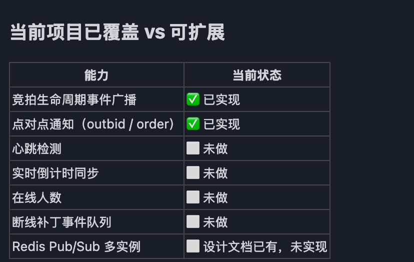

# TODO

## P0 — 业务完整性

### 定时任务（cron）

- [ ] **自动开始竞拍** — 商品上架后按 `rule.start_time` 自动触发 `StartItem`，复用现有服务方法，挂到 `kernel.Engine.Cron`
- [ ] **自动结束过期竞拍** — `EndExpiredAuctions()` 已实现，接入 cron 周期轮询（建议 5s），结束竞拍、创建订单、广播 `auction_ended`
- [ ] **订单超时关闭** — `pending` 订单超过 N 分钟未支付，状态流转为 `expired`，通过 cron 或订单创建时写入延迟任务触发

---

## P1 — 工程深度

### WebSocket 稳定性（题目明确要求）

- [ ] **心跳保活** — `StartReadLoop` 处理 `ping` 消息回 `pong`，服务端定时发 `ping` 检测僵尸连接；NAT 超时静默断连的根本解法
- [ ] **倒计时毫秒级同步** — 服务端每秒广播 `time_sync { item_id, ends_at_unix_ms }`，客户端以服务端时间为准，解决本地时钟漂移（反狙击延时后尤为关键）
- [ ] **出价防抖限流** — Redis 滑动窗口，同一用户对同一商品 1s 内最多 5 次，超出返回 429；题目提到「防抖节流」，此处为服务端侧实现

### 可观测性（设计文档已有：`docs/superpowers/specs/2026-05-25-observability-design.md`）

- [ ] **结构化日志** — 引入 `zap` 或 `zerolog`，关键链路（出价、竞拍结束、订单创建）打带 `trace_id` 的 JSON 日志
- [ ] **Prometheus metrics** — 出价 QPS、Lua 脚本延迟、WebSocket 连接数、HTTP 错误率
- [x] **健康检查接口** — `GET /health`，检查 MySQL + Redis 连通性，返回各组件状态
- [ ] **Grafana 看板** — 出价链路 P99 延迟、在线连接数、错误率趋势

---

## P2 — 质量与文档

- [ ] **E2E 集成测试** — 跑完整流程：注册 → 缴纳保证金 → 出价 → 竞拍结束 → 支付（`docs/agent-testing/` 框架已有）
- [ ] **Apifox 文档同步** — 将 `docs/5-21.md` 的接口导入 Apifox，支持 AI 驱动的接口测试
- [ ] **删除 `.golangci.yml`** — 无 CI 引用，本地也未使用，可直接删除

---

## P3 — 可选优化

- [ ] **Redis 降级策略** — Redis 不可用时出价链路如何降级（拒绝出价 vs 切 MySQL 兜底）
- [ ] **出价日志异步落库** — 当前同步写 MySQL，高并发下改为写 Redis LIST，worker 批量消费
- [ ] **Redis 读写分离** — 排行榜、商品详情等读操作走从库

---

## 补充 — 面试亮点（加分项）

> 以下内容不属于功能完整性要求，而是能在面试中体现工程深度的方向。

### 🔥 真正惊艳（实现后直接拉开差距）

- [ ] **压测 + 性能数据** — 用 `wrk` 或 `k6` 对出价接口压测，拿到真实 P50/P99/P999 数据；定位瓶颈（Lua 执行 vs MySQL 落库 vs 网络），形成「数据 → 结论 → 下一步优化」的完整叙述
- [ ] **故障场景分析** — 梳理 `EndExpiredAuctions` 中三个写操作（UpdateItem / DeleteState / CreateOrder）各自失败时的数据不一致范围，以及最小代价的补偿方案（无需实现，能说清楚即可）

### ✅ 有深度（代码量小，收益大）

- [ ] **pprof 性能剖析** — 对 WebSocket 广播做 CPU profile，定位 `json.Marshal` 热点，用 `sync.Pool` 复用 buffer，展示 Go 工程能力

### 📌 面试话题（不用实现，能讲清楚即可）

- **Lua 原子脚本 vs 乐观锁** — 题目提到乐观锁，实际用的是 Redis Lua 原子脚本：乐观锁需要「读-校验-写」三步，高竞争时重试率高；Lua 把所有校验和写操作压成一次原子操作，无锁无重试，P99 延迟更稳定
- **Redis Cluster CROSSSLOT 陷阱** — 当前 Lua 脚本的 4 个 key 在单节点无问题；迁移 Redis Cluster 时需用 `{itemID}` hash tag 保证同 slot，否则报 `CROSSSLOT` 错误
- **WebSocket 多实例扩展路径** — 现有 Hub 是进程内内存实现；多实例时改为 Redis Pub/Sub，各节点订阅自己管理的 room channel，`Broadcaster` 接口无需改动（设计文档 Section 10 已有）

---
告警 还没做